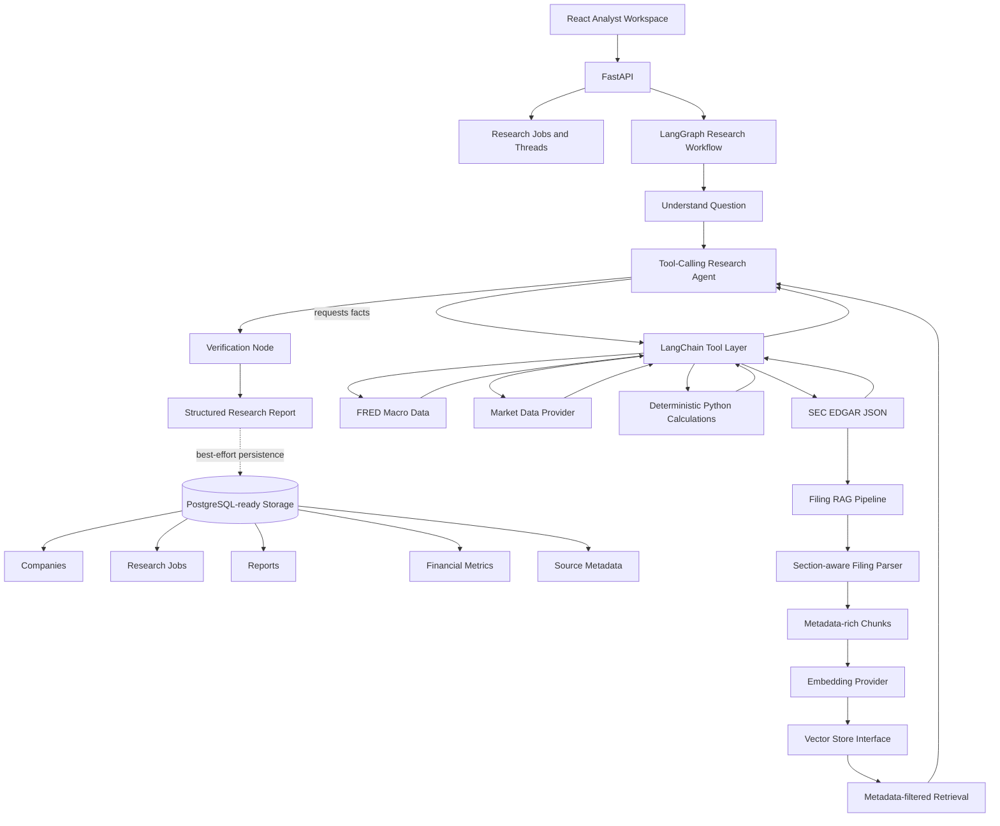

# Financial Research Agent

A production-oriented financial research application for analyzing public companies with traceable data, deterministic calculations, LLM-assisted synthesis, LangGraph orchestration, FastAPI, PostgreSQL-ready storage, SEC filing RAG foundations, and a React analyst workspace.

The core design rule is:

```text
LLM decides what information or analysis is required.
Tools and APIs retrieve factual information.
Python performs deterministic financial calculations.
LLM interprets and synthesizes the results.
```

The system is intentionally built so model output does not become the source of financial truth. Reported facts come from data providers, calculated metrics come from Python functions, and interpretation is clearly separated.


## Architecture



## What It Does

- Retrieves company facts, submissions, and filing metadata from SEC EDGAR structured JSON.
- Retrieves macroeconomic indicators from FRED.
- Retrieves quotes, price history, and company overviews through a replaceable market-data provider interface.
- Calculates financial metrics deterministically in Python.
- Exposes data and calculations to a single LangChain tool-calling research agent.
- Uses LangGraph to orchestrate the research loop, tool execution, verification, and final report creation.
- Verifies that numbers cited by the agent exist in tool results.
- Defines SQLAlchemy models and repositories for companies, research jobs, reports, financial metrics, source metadata, graph traces, raw provider responses, and filing chunks; completed research runs are persisted when a database is available.
- Parses SEC filing text into section-aware RAG chunks.
- Writes local Markdown and raw JSON debug artifacts for completed research runs.
- Serves a FastAPI backend and a React/Vite analyst interface.

## Project Layout

```text
backend/src/financial_research/
  agents/          single research agent
  api/             FastAPI app, routes, API schemas, job store
  calculations/    deterministic finance formulas
  config/          environment settings
  graph/           LangGraph state, workflow, verification
  llm/             configurable LLM factory and provider-content cleanup
  debug/           raw provider capture and Markdown debug reports
  middleware/      request logging, errors, validation
  rag/             filing parser, chunker, embeddings, vector store
  schemas/         Pydantic data contracts
  services/        SEC, FRED, market-data clients
  storage/         SQLAlchemy models and repositories
  tools/           LangChain tool wrappers

frontend/
  React/Vite analyst workspace

tests/
  mocked unit and integration-style tests
```

## Requirements

- Python 3.11+
- `uv`
- Node.js and npm
- API keys for live research, depending on selected providers

## Setup

From the repository root:

```powershell
uv sync
copy .env.example .env
```

Edit `.env` and set at least one LLM provider. The example configuration uses Groq:

```env
LLM_PROVIDER=groq
GROQ_API_KEY=your_groq_api_key
GROQ_MODEL=llama-3.1-70b-versatile
```

SEC also requires a descriptive user agent:

```env
SEC_USER_AGENT="Financial Research Agent your-email@example.com"
```

## Database Migrations

The application uses Alembic to version SQLAlchemy schema changes. Set `DATABASE_URL` in `.env`, then run migrations from the repository root:

```powershell
uv run alembic upgrade head
```

After changing `backend/src/financial_research/storage/models.py`, generate a migration and review it before applying it:

```powershell
uv run alembic revision --autogenerate -m "describe the schema change"
uv run alembic upgrade head
```

Useful commands are `uv run alembic current`, `uv run alembic history`, and `uv run alembic downgrade -1`. Alembic uses the same `DATABASE_URL` setting as the application. `create_all_tables()` remains available for isolated tests, but it is not the production schema migration path.

Optional provider keys:

```env
ALPHA_VANTAGE_API_KEY=your_alpha_vantage_key
FRED_API_KEY=your_fred_key
OPENAI_API_KEY=your_openai_api_key
GOOGLE_API_KEY=your_google_ai_studio_key
GOOGLE_MODEL=gemini-3.6-flash
OLLAMA_BASE_URL=http://localhost:11434
OLLAMA_MODEL=llama3.1
```

To use a Google AI Studio key, set the provider to Google:

```env
LLM_PROVIDER=google
GOOGLE_API_KEY=your_google_ai_studio_key
GOOGLE_MODEL=gemini-3.6-flash
```

`LLM_PROVIDER=gemini` is also accepted as an alias.

Debug reports are enabled by default:

```env
DEBUG_REPORTS_ENABLED=true
DEBUG_REPORTS_DIR=debug_reports
FILE_STORAGE_ENABLED=true
FILE_STORAGE_DIR=storage/runs
PROVIDER_CACHE_ENABLED=true
PROVIDER_CACHE_DIR=storage/provider_cache
SEC_CACHE_TTL_SECONDS=5184000
FRED_CACHE_TTL_SECONDS=21600
ALPHA_VANTAGE_CACHE_TTL_SECONDS=900
SEC_COMPANY_FACTS_HISTORY_LIMIT=5
DATABASE_PERSISTENCE_ENABLED=false
DATABASE_STORE_RAW_PROVIDER_PAYLOADS=false
```

## LangSmith Tracing

LangSmith tracing is optional and disabled by default. To send LangChain and LangGraph runs to LangSmith, add the following to `.env`:

```env
LANGCHAIN_TRACING_V2=true
LANGCHAIN_API_KEY=your_langsmith_api_key
LANGCHAIN_PROJECT=financial-research-agent
LANGCHAIN_ENDPOINT=https://api.smith.langchain.com
```

Restart the backend after changing these values. Each research graph run is tagged with the ticker and environment and includes metadata identifying the run. View traces in the configured LangSmith project at [smith.langchain.com](https://smith.langchain.com/).

The application continues to write local Markdown, raw JSON, filesystem, and optional database artifacts when LangSmith is disabled. Do not put provider API keys or sensitive research data into tags or metadata.

## Run The Backend

```powershell
uv run uvicorn financial_research.api.app:app --reload --app-dir backend/src --port 8001
```

Health check:

```text
http://127.0.0.1:8001/health
```

## Run The Frontend

```powershell
cd frontend
npm install
npm run dev
```

From the repository root, the equivalent command is:

```powershell
npm --prefix frontend run dev
```

Open:

```text
http://127.0.0.1:5173
```

The Vite app runs on `http://127.0.0.1:5173` and proxies API calls to `http://127.0.0.1:8001`.

## API

Available endpoints:

- `GET /health`
- `POST /research`
- `GET /research/{job_id}`
- `GET /companies/{ticker}`
- `POST /chat`
- `GET /threads/{thread_id}`

Example research request:

```json
{
  "ticker": "MSFT",
  "question": "Analyze Microsoft's fundamentals and valuation.",
  "stream": false
}
```

Set `stream` to `true` to receive high-level SSE progress events:

```text
research_started
fetching_sec_data
fetching_market_data
calculating_metrics
generating_analysis
verification_complete
finished
```

These events expose execution status only, not hidden model reasoning.

## Data Sources

SEC EDGAR:

- company ticker to CIK lookup
- company submissions
- recent filings
- latest 10-K
- latest 10-Q
- company facts / XBRL JSON

FRED:

- federal funds rate
- 10-year Treasury yield
- CPI
- unemployment rate
- GDP

Market data:

- quote
- price history
- company overview

The initial market-data implementation uses Alpha Vantage behind a provider protocol so it can be replaced later.

Provider JSON responses are cached on disk by default to avoid duplicate calls:

- SEC: 60 days, because filings/facts generally do not need to be refetched constantly for the same company.
- FRED: 6 hours, because macro observations update on their own release schedules and rarely need repeated same-hour calls.
- Alpha Vantage: 15 minutes, because quotes are more time-sensitive and free-tier limits are tight.

The cache stores raw provider JSON under `storage/provider_cache/`. API keys are not written into cache keys or cache metadata.

## Financial Calculations

Calculations live in `financial_research.calculations` and do not use the LLM.

Implemented formulas include:

- year-over-year revenue growth
- CAGR
- gross margin
- operating margin
- net margin
- free cash flow
- debt-to-equity
- ROIC
- P/E
- price-to-sales
- EV/EBITDA
- DCF helper functions

## Agent And Graph

The app uses one research agent, not a multi-agent system. The agent can call tools for SEC data, market data, macro data, and deterministic calculations.

LangGraph controls the workflow:

```text
Understand Question
Research Agent
Tools, when requested
Research Agent
Verification
Structured Report
```

The graph has a bounded tool loop to prevent runaway execution.

Model provider content is normalized before it is stored in graph state. Rich provider metadata, such as Gemini content-part signatures, is removed while tool calls are preserved. SEC revenue history compares compatible concepts and selects the newest annual series; revenue growth is withheld when its history is materially older than other annual facts.

## Verification

The verification node checks whether numbers in the final model response appear in tool results. It also extracts source URLs and deterministic calculation outputs from tool messages.

Unsupported numeric claims are flagged instead of silently accepted.

Reports distinguish:

- reported facts
- calculated metrics
- LLM interpretation
- sources

## Filing RAG

The filing RAG foundation parses 10-K and 10-Q text into section-aware chunks. Metadata includes:

- ticker
- CIK
- accession number
- filing type
- filing date
- fiscal period
- section
- source URL

Embedding generation and vector storage are injected behind interfaces. Tests use deterministic local embeddings and an in-memory vector store. Production can later swap in managed embeddings and PostgreSQL/pgvector or another vector database.

## Storage

The default local persistence is hybrid filesystem-first storage:

- `debug_reports/` contains human-readable Markdown plus a single raw JSON capture for each run.
- `storage/runs/` contains split JSON artifacts for each completed run: metadata, final report, graph trace, messages, tool results, and one file per raw provider response.
- `storage/provider_cache/` contains reusable provider responses to avoid duplicate SEC, FRED, and Alpha Vantage calls.

SQLAlchemy models are PostgreSQL-oriented and cover:

- companies
- research jobs
- reports
- financial metrics
- source metadata
- graph traces
- raw provider responses
- filing chunks

Schema changes are tracked in `migrations/`. Apply them with Alembic before enabling database persistence in a new environment.

The current API still uses an in-memory job store for polling active local jobs. Completed research runs are saved to the filesystem by default. SQLAlchemy/PostgreSQL persistence is optional and runs only when `DATABASE_PERSISTENCE_ENABLED=true` and `DATABASE_URL` points to an available database. By default, database provider-response rows store file paths instead of full raw JSON payloads; set `DATABASE_STORE_RAW_PROVIDER_PAYLOADS=true` only if you explicitly want those large payloads copied into the database.

## Frontend

The React workspace includes:

- ticker input
- research question input
- run state and progress indicators
- metric cards
- report tabs
- Markdown-rendered analysis in Overview, Fundamentals, and Valuation tabs
- source citation list
- job polling against the FastAPI backend

It is an analyst workspace, not a marketing landing page.

## Testing

Run:

```powershell
uv run pytest -v
```

Normal tests mock external API calls and do not require paid APIs.

The suite covers:

- financial calculations
- SEC parsing and failures
- FRED parsing and failures
- market-data parsing and failures
- LangChain tool wrappers
- research prompt and structured output setup
- provider-content cleanup and debug report generation
- LangGraph routing and verification
- storage repositories
- filing RAG chunking and retrieval
- FastAPI routes

## Known Limitations

- Live research requires valid provider keys.
- The API polling job store is currently in-memory.
- Filing RAG indexing is implemented as a foundation but is not yet exposed through a user-facing API workflow.
- Completed research runs are persisted to the filesystem by default; optional database persistence is best-effort when enabled.
- Debug reports and filesystem run archives are local diagnostic/persistence artifacts; they are excluded from Git.
- Alpha Vantage free-tier rate and daily request limits can affect market-data prompts.
- The verifier is conservative and numeric-string based; deeper claim verification can be expanded.
- This system is research support, not guaranteed investment advice.
