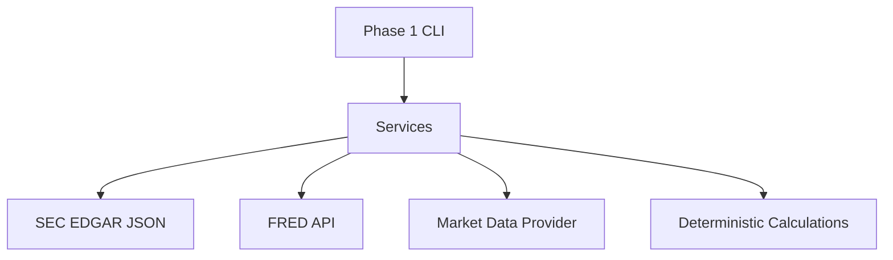
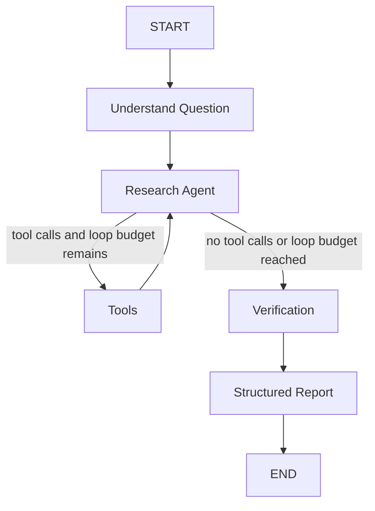
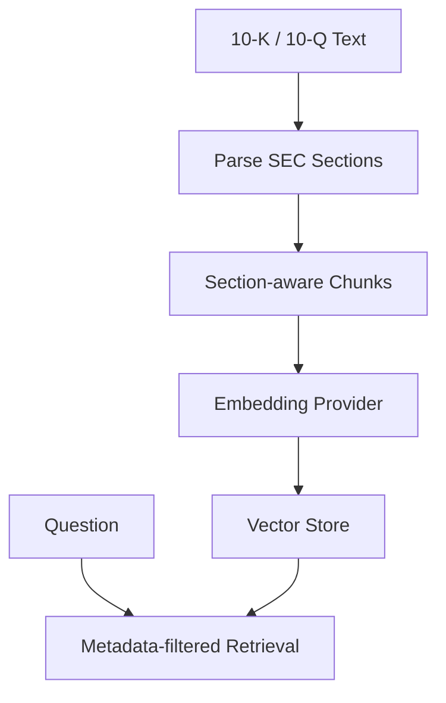

# Financial Research Agent

Phase 1 builds the backend foundation for a financial research system. It keeps factual data retrieval in service modules and deterministic finance math in plain Python functions.



## Setup

```powershell
uv sync
copy .env.example .env
```

Set `SEC_USER_AGENT` to a value that identifies your application and contact information, as required by SEC fair access guidance.

## Phase 1 Commands

```powershell
uv run python -m financial_research.main --company AAPL
uv run python -m financial_research.main --macro
uv run pytest -v
```

## Data Sources

- SEC EDGAR structured JSON for company tickers, submissions, recent filings, and company facts.
- FRED API for macroeconomic series.
- Alpha Vantage behind a replaceable market data provider interface.

## Current Limitations

LangGraph workflow, FastAPI routes, database persistence, RAG, and React frontend are not implemented yet.

## Phase 2

Phase 2 wraps the Phase 1 services and calculations as LangChain tools. Services still perform the work; tools only expose that work to the LLM.

Available tool groups:

- SEC tools: company profile, company facts, latest 10-K, latest 10-Q.
- Market tools: quote, price history, company overview.
- Macro tools: FRED indicators and interest rates.
- Calculation tools: revenue growth, CAGR, margins, P/E, price-to-sales, EV/EBITDA, debt-to-equity.

The single research agent is defined in `financial_research.agents.research_agent`. Its system prompt requires tool use for facts, deterministic tools for arithmetic, source traceability, period labeling, and clear separation of reported facts, calculated metrics, and interpretation.

## Phase 3

Phase 3 adds a LangGraph workflow around the single research agent:



The graph state tracks messages, ticker, research question, sources, calculated metrics, tool results, verification status, unsupported claims, iteration count, and the final report.

The verification node checks that numbers in the final response appear in tool results, extracts SEC source URLs, and records deterministic calculation outputs. It flags unsupported claims instead of silently rewriting model-generated analysis.

## Phase 4

Phase 4 adds PostgreSQL-oriented storage and a filing RAG foundation.

Storage tables:

- `companies`
- `research_jobs`
- `reports`
- `financial_metrics`
- `source_metadata`
- `filing_chunks`

The RAG pipeline parses SEC filing text into section-aware chunks, preserving metadata for ticker, CIK, accession number, filing type, filing date, fiscal period, section, and source URL. Embedding generation and vector storage are dependency-injected so local tests can use deterministic embeddings while production can later use a managed embedding model and PostgreSQL/pgvector or another vector store.

Example internal flow:



## Phase 5

Phase 5 adds the API and frontend application.

FastAPI endpoints:

- `GET /health`
- `POST /research`
- `GET /research/{job_id}`
- `GET /companies/{ticker}`
- `POST /chat`
- `GET /threads/{thread_id}`

`POST /research` accepts:

```json
{
  "ticker": "MSFT",
  "question": "Analyze Microsoft's fundamentals and valuation.",
  "stream": false
}
```

Set `stream` to `true` to receive high-level SSE events such as `research_started`, `fetching_sec_data`, `calculating_metrics`, `verification_complete`, and `finished`. These events do not expose hidden chain-of-thought.

Run the backend:

```powershell
uv run uvicorn financial_research.api.app:app --reload --app-dir backend/src
```

Run the frontend:

```powershell
cd frontend
npm install
npm run dev
```

The Vite app proxies API requests to `http://127.0.0.1:8000`. The analyst workspace includes ticker input, research question input, loading/status state, report tabs, metric cards, and source citations.

Production-oriented pieces added in this phase:

- request IDs
- structured request logging
- provider/application error normalization
- ticker input validation
- high-level streaming progress events
- thread/job in-memory coordination for local MVP workflows
